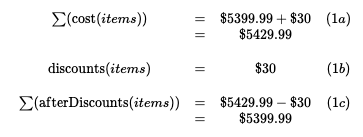
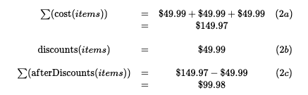
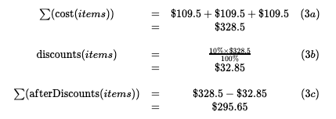

# BE Candidate Take Home Test

[](https://codecov.io/gh/aceslick911/bcg-checkout)

## Requirements Analysis
> Have you shopped online? Let’s imagine that you need to build the checkout backend service that will support different promotions with the given inventory.
Build a checkout system with these items:

```javascript

[
  { SKU:"120P90", Name:"Google Home",    Price:49.99,   Inventory_Qty:10 },
  { SKU:"43N23P", Name:"MacBook Pro",    Price:5399.99, Inventory_Qty:5 },
  { SKU:"A304SD", Name:"Alexa Speaker",  Price:109.5,   Inventory_Qty:10 },
  { SKU:"234234", Name:"Raspberry Pi B", Price:30,      Inventory_Qty:2 },
]

```

>The system should have the following promotions:
>
> ● Each sale of a MacBook Pro comes with a free Raspberry Pi B
>
> ● Buy 3 Google Homes for the price of 2
>
> ● Buying more than 3 Alexa Speakers will have a 10% discount on all Alexa speakers
>

> Example Scenarios:
>
> Scanned Items: MacBook Pro, Raspberry Pi B
>
> Total: $5,399.99
>
> Scanned Items: Google Home, Google Home, Google Home
>
> Total: $99.98
>
> Scanned Items: Alexa Speaker, Alexa Speaker, Alexa Speaker
>
> Total: $295.65
>

> Please write it in Golang or Node with a CI script that runs tests and produces a binary.
> Finally, imagine that adding items to cart and checking out was a backend API. Please design a schema file for GraphQL on how you would do this.
> 
> Thank you for your time and we look forward to reviewing your solution. If you have any questions, please feel free to contact us. 
> 
> Please send us a link to your git repo.

## Key Points taken from Requirements
 - build the `checkout backend service`
 - Build a checkout system with `these items`
   - Google Home
   - MacBook Pro 
   - Alexa Speaker
   - Raspberry Pi B
 - support different `promotions` with the `given inventory`
   - Each sale of a `MacBook Pro` comes with a `free` `Raspberry Pi B`
   - Buy `3` `Google Homes` for the price of `2`
   - Buying more than `3` `Alexa Speakers` will have a `10% discount` on all `Alexas speakers`
 - write it in `Golang` or `Node` with a `CI script` that `runs tests` and `produces a binary`
## Example Scenarios
- checkoutCost( [ `MacBook Pro` , `Raspberry Pi B` ] ) = `$5399.99`


<!-- $$\begin{matrix}
 \sum(\mathrm{cost}(items)) & = & \$5399.99 + \$30 & (1a) \\
 & = & \$5429.99 & \\  \\
\mathrm{discounts}(items) & = & \$30  & (1b) \\ \\
 \sum(\mathrm{afterDiscounts}(items)) & = & \$5429.99 - \$30 & (1c) \\
 & = & \$5399.99 & \\  \\
\end{matrix}$$ -->

- checkoutCost( [ `Google Home` , `Google Home` , `Google Home` ] ) = `$99.98`

<!-- $$\begin{matrix}
 \sum(\mathrm{cost}(items)) & = & \$49.99+ \$49.99+ \$49.99 & (2a) \\
 & = & \$149.97 & \\  \\
\mathrm{discounts}(items) & = & \$49.99  & (2b) \\ \\
 \sum(\mathrm{afterDiscounts}(items)) & = & \$149.97 - \$49.99 & (2c) \\
 & = & \$99.98 & \\  \\
\end{matrix}$$ -->

   - checkoutCost( [ `Alexa Speaker` , `Alexa Speaker` , `Alexa Speaker` ] ) = `$295.65`


<!-- $$\begin{matrix}
 \sum(\mathrm{cost}(items)) & = & \$109.5 +\$109.5 +\$109.5 & (3a) \\
 & = & \$328.5 & \\  \\
\mathrm{discounts}(items) & = & \frac{10\% \times \$328.5}{100\%}    & (3b) \\ 
   & = & \$32.85   \\ \\
 \sum(\mathrm{afterDiscounts}(items)) & = & \$328.5 - \$32.85 & (3c) \\
 & = & \$295.65 & \\  \\
\end{matrix}$$ -->


### Assessment criteria

**Assumptions**
 - Demonstrate capability in Javascript(NodeJS) and GoLang
   - Create a REST API backend service
   - Instantiate the sample dataset for IOT products for sale
 - Reduce the problem to individual, trivially solvable problems
 - 
